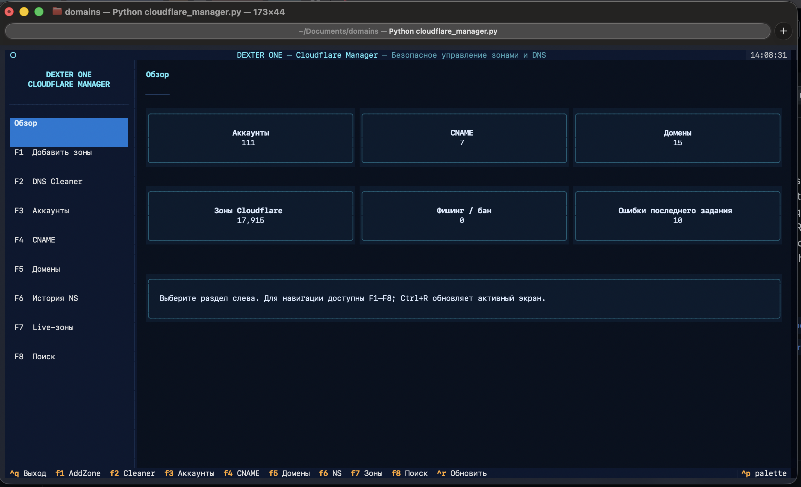

# DEXTER ONE — Cloudflare Manager

Терминальный менеджер для массовой работы с зонами Cloudflare: добавление доменов, чистка DNS, CNAME-шаблоны, поиск фишинговых/забаненных зон и история NS — всё в одном TUI, без веб-панели.



## Возможности

- **Мультиаккаунтность** — работа сразу с несколькими Cloudflare-аккаунтами (`dex_accounts.json`), с группировкой зон по команде и маскированием API-ключей в интерфейсе.
- **Добавление зон** — массовая загрузка доменов (`domains.txt`), параллельное создание зон с ограничением конкурентности и живым прогресс-баром.
- **DNS Cleaner** — пакетная зачистка/нормализация DNS-записей по списку доменов.
- **CNAME-шаблоны** — управление набором целевых CNAME (`dex_cnames.json`) и применение их к выбранным зонам.
- **Живые зоны** — таблица всех зон по аккаунтам с фильтрами, поиском, определением фишинга/бана и групповыми действиями (удаление, применение CNAME).
- **История NS** — лог смен NS-серверов с фильтрацией и экспортом.
- **Классический режим** — совместимый curses-фолбэк на случай отсутствия Textual или запуска не в tty (`--classic`).

## Установка

```bash
python3 -m pip install -r requirements.txt
```

Требуется Python 3.11+.

## Запуск

```bash
python3 cloudflare_manager.py
```

По умолчанию открывается новый TUI на [Textual](https://github.com/Textualize/textual). Принудительно запустить классический curses-интерфейс:

```bash
python3 cloudflare_manager.py --classic
```

## Навигация

| Клавиша | Раздел |
| --- | --- |
| `F1` | Добавить зоны |
| `F2` | DNS Cleaner |
| `F3` | Аккаунты |
| `F4` | CNAME |
| `F5` | Домены |
| `F6` | История NS |
| `F7` | Live-зоны |
| `F8` | Поиск |
| `Ctrl+R` | Обновить активный экран |
| `Ctrl+Q` | Выход |

## Структура проекта

```
cf_manager/
├── tui.py        # Textual-интерфейс: экраны, модалки, панели
├── services.py   # Клиент Cloudflare API (зоны, DNS, поиск, фишинг)
├── jobs.py       # Параллельный раннер фоновых заданий с прогрессом
├── storage.py    # Хранилище аккаунтов, CNAME, доменов и истории NS
└── models.py     # Датаклассы: Account, Zone, CnameTarget, JobResult/Progress

cloudflare_manager.py  # Точка входа + классический curses-режим
tests/                 # pytest-набор для cf_manager
```

## Данные и конфигурация

Приложение хранит состояние рядом с собой в JSON/txt-файлах:

- `dex_accounts.json` — аккаунты Cloudflare (email + API key)
- `dex_cnames.json` — шаблоны CNAME-целей
- `domains.txt` / `failed_domains.txt` — списки доменов для обработки
- `logs/` — журналы сессий

Эти файлы содержат чувствительные данные (API-ключи) — не коммитьте их с реальными значениями.

## Тесты

```bash
pytest
```
